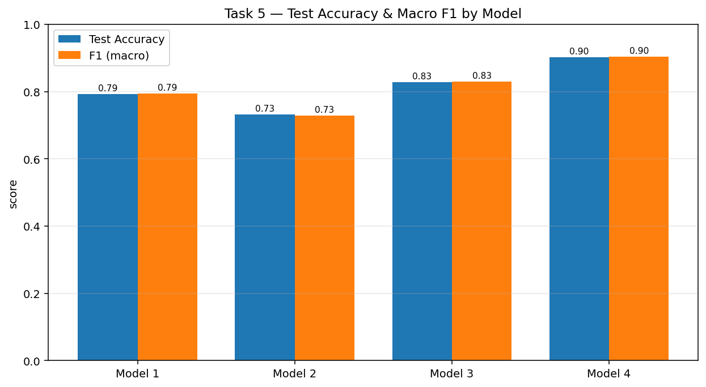
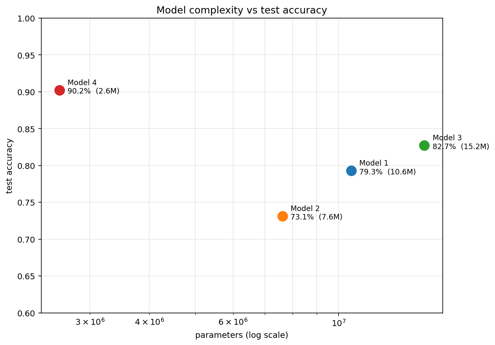

# SceneDepth — CNN Architecture Depth Analysis for Natural Scene Classification

**AI503 Machine Learning · Assignment 3** — Image Classification using Convolutional Neural Networks
Author: **Fadi Alazayem**

> **Research question** — *At what depth does a CNN trained on natural-scene classification reach diminishing returns, and does transfer learning from a large-scale dataset overcome this ceiling?*

The full, executed analysis (all outputs embedded) lives in **[`SceneDepth_CNN_Classification.ipynb`](SceneDepth_CNN_Classification.ipynb)**.

## Abstract

Four convolutional architectures of increasing depth are trained and evaluated on the Intel Image Classification dataset (six natural-scene classes, 150×150 RGB), then compared against a two-stage MobileNetV2 transfer-learning model. The depth–accuracy relationship proves **non-monotonic**: a four-convolution network *underperforms* a two-convolution baseline, and the best custom network plateaus around 83% — roughly seven points below transfer learning (90.2%). A battery of diagnostics (an overfitting ablation, a learning-rate control, per-class metrics, Grad-CAM, and a parameter-efficiency analysis) shows that *generalisation is governed by regularisation and feature quality, not raw depth or capacity*. Everything was run locally on CPU (Apple M3 Pro).

## Dataset

[Intel Image Classification](https://www.kaggle.com/datasets/puneet6060/intel-image-classification) — ~25,000 images in the Kaggle package; this study uses the **17,034 labelled images** (14,034 train/validation + 3,000 test) across six classes (`buildings`, `forest`, `glacier`, `mountain`, `sea`, `street`); the unlabelled prediction set is not used. All images 150×150 RGB.

| Split | Images |
|---|---|
| Train (`seg_train`) | 14,034 → 80/20 train/val (seed 42) |
| Test (`seg_test`, held out) | 3,000 |

## Results

| Model | Architecture | Params | Test Acc | Macro F1 |
|---|---|--:|--:|--:|
| Model 1 | Basic CNN — 2 conv | 10.6M | 79.3% | 0.795 |
| Model 2 | Medium CNN — 4 conv + BN | 7.6M | 73.1% | 0.729 |
| Model 3 | Deep CNN — 5 conv + BN + cosine-LR | 15.2M | 82.7% | 0.829 |
| **Model 4** | **MobileNetV2 — 2-stage transfer learning** | **2.6M** | **90.2%** | **0.904** |



## Key findings

- **Depth is not monotonically beneficial.** Model 2 (4 conv) scored ~6 points *below* the 2-conv Model 1, collapsing low-texture scenes into `sea` (190 glaciers + 151 mountains misread as sea).
- **The Model 2 dip is seed-stable; the full ordering is not** (3 seeds: 42, 101, 202). Mean test accuracy — Model 1 **79.7% ± 1.4**, Model 2 **75.2% ± 1.8**, Model 3 **80.7% ± 2.6**. **Model 2 < Model 1 in all three seeds** (Model 2's best seed, 76.5%, still sits below Model 1's worst, 78.5%), so the depth *dip* is robust. The Model 1 vs Model 3 ordering, however, is **not** statistically stable: their error bars overlap and Model 3 falls *below* Model 1 in seed 101 (77.8% vs 78.5%). See `extension_multiseed_stability.png`.
- **The dip is a genuine training difficulty — not just the learning rate.** A control model (**Model 2b** = Model 2 + cosine LR) did **not** recover (72.7%, −0.4 pts), so Model 3's recovery owes to its added capacity and larger head, not the schedule.
- **Regularisation, not size, controls generalisation.** An ablation (**Model 1-NoReg**, no augmentation/dropout) overfits hard — finishing at 98.4% train / 75.0% val, a *final* train–val gap of ~23 percentage points (≈27 at its widest), versus the regularised twin whose gap peaked near 5 points (final ~3). See `extension_overfitting_comparison.png`.
- **Transfer learning wins on accuracy *and* efficiency.** MobileNetV2 is both the most accurate **and** the smallest model (2.6M params), clearing the ~83% custom-CNN ceiling. `glacier` — the hardest class throughout (F1 0.72 → 0.85 from Model 1 to Model 4) — improves most.



## Repository structure

| Path | Purpose |
|---|---|
| `SceneDepth_CNN_Classification.ipynb` | **The deliverable** — executed notebook, Tasks 1–7 + extensions, all outputs |
| `build_notebook.py` / `build_extensions.py` | Generators for the main notebook and the extensions section |
| `postprocess.py` / `postprocess_ext.py` | Inject the evidence-grounded discussion numbers |
| `parse_histories.py` | Recover original per-epoch curves from the training log |
| `merge_extensions.py` | Append executed extension cells without retraining Models 1–4 |
| `smoke_test.py`, `analyze_confusion.py` | Pipeline smoke test; confusion-structure analysis |
| `run_multiseed.py`, `make_multiseed_figure.py` | Multi-seed stability run (seeds 42/101/202, Models 1–3) + figure |
| `results_summary.json`, `confusion_detail.json`, `original_histories.json`, `ext_results.json`, `multiseed_results.json` | Machine-readable metrics (incl. multi-seed stability) |
| `*.png` | All figures — sample grid, training histories, confusion matrices, comparison, LR schedule, Grad-CAM (mistakes **and** correct), overfitting, per-class metrics, complexity, multi-seed stability |

> Trained `*.keras` weights (up to ~174 MB) and the dataset are **not** committed — regenerate by running the notebook.

## Reproduce

```bash
pip install -r requirements.txt

# Kaggle auth (classic CLI): place kaggle.json at ~/.kaggle/kaggle.json
mkdir -p ~/.kaggle && mv ~/Downloads/kaggle.json ~/.kaggle/ && chmod 600 ~/.kaggle/kaggle.json

# Open and run top-to-bottom
jupyter notebook SceneDepth_CNN_Classification.ipynb
```

Seed **42** is fixed across NumPy / TensorFlow / Python `random` / `PYTHONHASHSEED`. Trained locally on an **Apple M3 Pro, CPU-only** (~1h40m for the four models, ~30 min for the extension diagnostics).

## Extensions (extra-mile analysis)

Appended as a clearly-marked section in the notebook; Models 1–4 are reloaded, never retrained:

- **A — Overfitting demonstrated** (`extension_overfitting_comparison.png`): regularised vs unregularised Model 1.
- **B — Diagnosing the Model 2 dip** (Model 2b control): isolates optimisation from architecture.
- **C — Per-class precision/recall/F1** (`extension_per_class_metrics.png`): Model 1 vs Model 4.
- **D — Grad-CAM on correct predictions** (`extension_gradcam_correct.png`): contrasts attention when right vs wrong.
- **E — Complexity vs accuracy** (`extension_complexity_vs_accuracy.png`): the parameter-efficiency trade-off.
- **F — Multi-seed stability** (`extension_multiseed_stability.png`): Models 1–3 over seeds 42/101/202, mean ± s.d., confirming the depth ordering is not a single-seed artefact.
- Plus the required-extension trio: Grad-CAM on misclassifications, two-stage MobileNetV2 fine-tuning, and cosine-decay LR schedule analysis.

### Notes & deviations

Grad-CAM is implemented manually with `tf.GradientTape` (the PyPI `grad-cam` package is PyTorch-only). The Model 3 cosine schedule uses `decay_steps = steps_per_epoch × epochs` rather than a literal `1000` (which would zero the learning rate after ~3 epochs). All prose is in British English; analysis is vendor-neutral.
