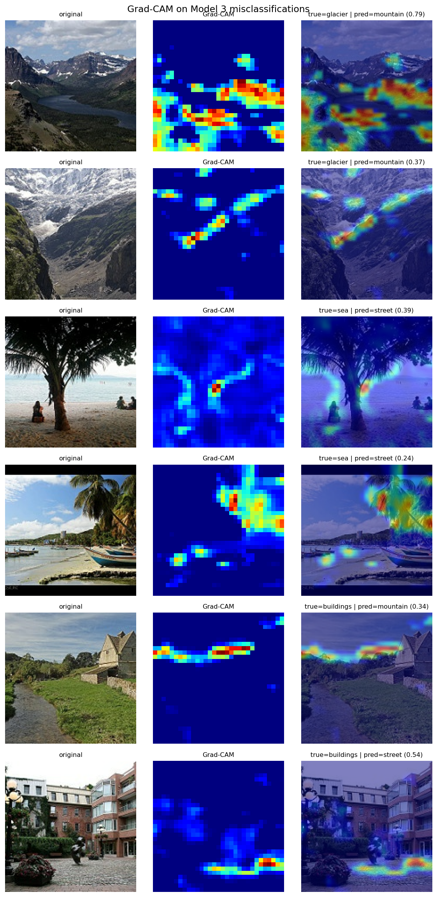

# SceneDepth — CNN Architecture Depth Analysis for Natural Scene Classification

**AI503 Machine Learning — Assignment 3** · Image Classification using CNNs
Author: **Fadi Alazayem**

> **Research question:** *At what depth does a CNN trained on natural-scene classification reach diminishing returns, and does transfer learning from a large-scale dataset overcome this ceiling?*

The complete, executed analysis lives in **[`SceneDepth_CNN_Classification.ipynb`](SceneDepth_CNN_Classification.ipynb)** (all outputs embedded).

---

## Dataset

[Intel Image Classification](https://www.kaggle.com/datasets/puneet6060/intel-image-classification) — ~25k natural-scene photos at 150×150 RGB across **6 classes**: `buildings`, `forest`, `glacier`, `mountain`, `sea`, `street`.

| Split | Images |
|---|---|
| Train (`seg_train`) | 14,034 → 80/20 train/val |
| Test (`seg_test`, held out) | 3,000 |

## Results

| Model | Architecture | Test Acc | Macro F1 |
|---|---|---|---|
| Model 1 | Basic CNN — 2 conv | 79.3% | 0.795 |
| Model 2 | Medium CNN — 4 conv + BN | **73.1%** | 0.729 |
| Model 3 | Deep CNN — 5 conv + BN + cosine-LR | 82.7% | 0.829 |
| **Model 4** | **MobileNetV2 (2-stage transfer learning)** | **90.2%** | **0.904** |


### Headline finding — depth is *not* monotonically better

Adding depth did **not** smoothly improve accuracy. **Model 2 (4 conv) performed ~6 points *worse* than the 2-conv Model 1**, collapsing low-texture scenes into `sea` (190 glaciers + 151 mountains mislabelled as sea). Only Model 3 — deeper *and* paired with a cosine learning-rate schedule and a larger regularised head — surpassed the baseline. The best custom network plateaued at ~83%, roughly **7 points below transfer learning (90.2%)**. `glacier` was the hardest class for every model (recall 0.63 → 0.44 → 0.69 → 0.83). Full discussion in Task 6 of the notebook.

### Grad-CAM (extension)

Manual `GradientTape` Grad-CAM on Model 3's misclassifications shows the network attending to the **horizon band and broad texture** rather than object-defining regions — explaining the glacier/sea/mountain confusions.



## What's covered

- **Task 1** dataset description + sample grid · **Task 2** preprocessing pipeline (resize, 80/20 split, normalisation, augmentation, cache/prefetch)
- **Tasks 3–4** three custom CNNs of increasing depth, trained & evaluated
- **Task 5** comparison table + charts · **Task 6** results discussion · **Task 7** improvements applied
- **Extensions:** Grad-CAM on misclassifications · two-stage MobileNetV2 fine-tuning · cosine-decay LR schedule analysis

## Reproduce

```bash
pip install -r requirements.txt

# Kaggle auth (classic CLI): place kaggle.json at ~/.kaggle/kaggle.json
mkdir -p ~/.kaggle && mv ~/Downloads/kaggle.json ~/.kaggle/ && chmod 600 ~/.kaggle/kaggle.json

# Option A — open and run top-to-bottom
jupyter notebook SceneDepth_CNN_Classification.ipynb

# Option B — regenerate the notebook from source + execute headlessly
python build_notebook.py          # emits the blank notebook
papermill SceneDepth_CNN_Classification.ipynb run_output.ipynb -k python3 --log-output
python postprocess.py             # writes the final discussion numbers
```

Seed **42** is fixed across NumPy / TensorFlow / Python `random` / `PYTHONHASHSEED`.

## Repository layout

| File | Purpose |
|---|---|
| `SceneDepth_CNN_Classification.ipynb` | **The deliverable** — executed notebook with all outputs |
| `build_notebook.py` | Generates the notebook from source cells |
| `postprocess.py` | Injects the evidence-grounded Task 6 discussion |
| `smoke_test.py` | Pipeline + Grad-CAM smoke test, per-step timing |
| `analyze_confusion.py` | Recomputes confusion structure for the discussion |
| `results_summary.json`, `confusion_detail.json` | Machine-readable metrics |
| `*.png` | All figures (sample grid, histories, confusion matrices, comparison, LR schedule, Grad-CAM) |

> Trained `*.keras` weights (up to 174 MB) and the dataset are **not** committed — regenerate by running the notebook.

## Environment & deviations from the brief

Executed **locally on an Apple M3 Pro, CPU-only** (≈ 1h40m for all four models), not Colab/GPU. Notable, documented deviations:

1. **Local adaptation** — removed `google.colab`, used local paths and a disk-backed `tf.data` cache (memory-safe within 18 GB).
2. **Grad-CAM implemented manually** with `tf.GradientTape` — the PyPI `grad-cam` package is PyTorch-only.
3. **Cosine `decay_steps`** set to `steps_per_epoch × epochs` rather than the literal `1000` in the brief, which would have driven the learning rate to ≈0 after ~3 epochs and starved the deep network. Documented in the Model 3 cell.

All prose in British English.
